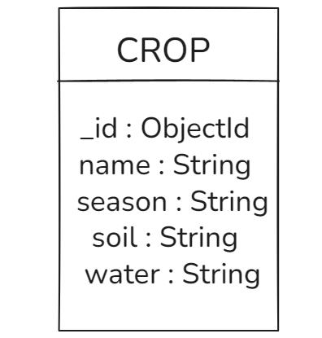

# AI Crop Advisory Platform

AI-powered crop advisory and farmer assistance platform for TBI GEU SIP 2026.

## Project Description

This project uses a Node.js and Express backend with a React, Vite, React Router, and Tailwind CSS frontend. The frontend fetches crop data from the backend API and displays crop details such as crop name, season, soil type, and water requirement.

## Backend Setup

```bash
cd backend
npm install
node server.js
```

Backend runs at:

```text
http://localhost:5000
```

Crop API endpoint:

```text
GET http://localhost:5000/api/crops
```

## Frontend Setup

```bash
cd frontend
npm install
npm run dev
```

Frontend runs at the URL shown by Vite, usually:

```text
http://localhost:5173
```

## Database

**Database Used:** MongoDB Atlas

### Why MongoDB?

MongoDB is a NoSQL database that provides flexible document storage and integrates easily with Mongoose for Node.js applications.

## Database Schema

Entity: Crop

Fields:
- _id
- name
- season
- soil
- water

(Schema diagram attached below.)

## Database Setup

1. Create a `.env` file inside the backend folder.
2. Add the following variables:

```env
MONGO_URI=your_mongodb_connection_string
PORT=5000
```

3. Install dependencies:

```bash
cd backend
npm install
```

4. Start the backend:

```bash
node server.js
```

## Database Schema

